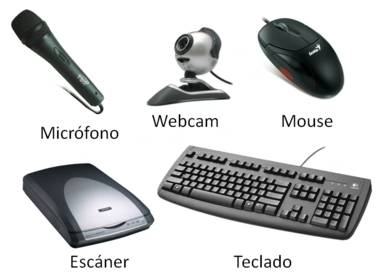
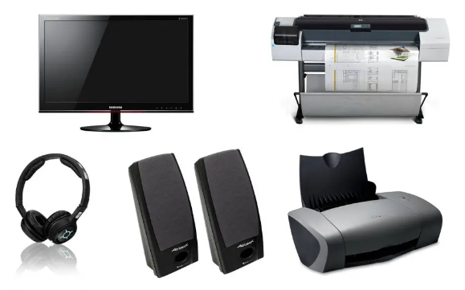
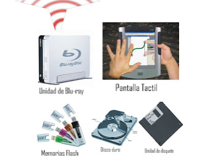
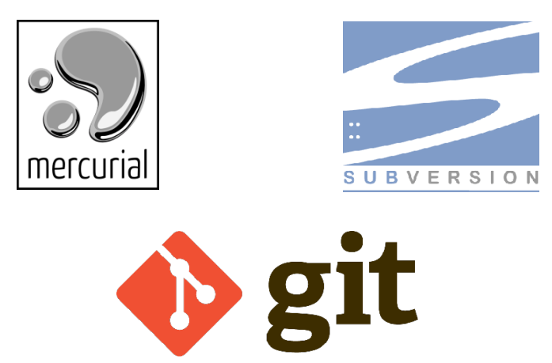
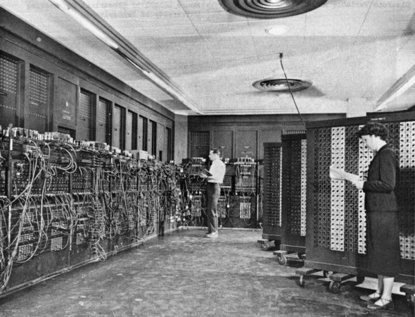
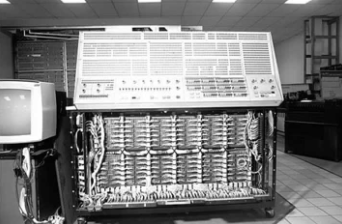
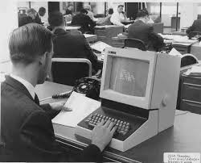

# Primer Parcial

## Introduccion a los sistemas operativos
Un sistema operativo consiste en un conjunto de programas diseñados para facilitar la interacción y gestión de los componentes de una computadora o dispositivo electrónico durante su uso.

Los sistemas operativos existen para:

 - Computadoras
 - Telefonos
 - Televisiones
 - Relojes
 - Electrodomesticos

Las tareas principales de los administradores de sistemas incluyen:

 - Instalar sistemas operativos y software
 - Corregir problemas y errores en los sistemas
 - Automatizar tareas y mejorar el rendimiento general para la organizacion

## Servicios del Sistema Operativo

Los servicios del sistema operativo constituyen un conjunto esencial de funciones y procesos fundamentales que facilitan y gestionan las operaciones de una computadora o dispositivo electrónico. 

### 1-Ejecucion de programas:

 - Iniciar una aplicacion
 - Ejecutar un comando
 - Abrir una carpeta
 - Abrir una pagina especifica de internet

### 2-Dispositivos E/S

Dispositivos de Entrada:

Los dispositivos de entrada son herramientas que se encargan de ingresar datos a la memoria principal de la computadora para su procesamiento. Estos dispositivos convierten la información de entrada en señales eléctricas.

Dispositivos de Salida:

Los dispositivos de salida son los elementos que muestran la información al usuario en formatos comprensibles, ya sea mediante imágenes, texto, sonidos o mediante interfaces táctiles. Su función principal consiste en sacar datos desde la memoria principal hacia el entorno externo.

Dispositivos Mixtos:

Los dispositivos de entrada y salida, también conocidos como dispositivos mixtos, posibilitan tanto la entrada como la salida de datos hacia y desde la memoria central.

### 3-Manipulacion de archivos y directorios

 - Reconocer archivos o directorios, incluyendo su denominación, ubicación, permisos, entre otros detalles.
 - Generar un archivo recién creado.
 - Desplazar archivos de un lugar a otro.
 - Borrar directorios y archivos.

### 4-Comunicacion entre procesos

Los procesos tienen la capacidad de intercambiar información entre ellos mediante la utilización de secciones de memoria compartida, que pueden consistir en variables compartidas, buffers, o mediante herramientas específicas.

### 5-Comunicacion entre equipos remotos

Es una técnica que habilita a un usuario para establecer una conexión con otro ordenador desde su propio equipo (cliente). Se utiliza en el ámbito informático para referirse a la capacidad de ejecutar ciertas tareas en un ordenador sin necesidad de estar físicamente presente en el equipo.

### 6-Administracion de la proteccion y seguridad

La meta de la gestión de seguridad consiste en garantizar la precisión, integridad y salvaguarda de todos los procedimientos y activos presentes en los sistemas de información.

 - Cifrado
 - Firewalls
 - DoS
 - Monitoreo de correos electronicos
 - Defensa contra virus

### 7-Leer estado del sistema
Cada proceso dentro de un sistema operativo tiene un estado que refleja su condición actual de ejecución. El número de estados posibles puede variar entre diferentes sistemas operativos.

## Sistema de control de versiones

Se refiere al manejo de los múltiples ajustes o modificaciones aplicados a los componentes de un producto o su configuración.

## Evolucion de los sistemas operativos

### Primer Nivel

 - Sistemas operativos fundamentales.
 - Aparecieron en la década de 1950.
 - Utilización del lenguaje de programación FORTRAN.
 - La programación se realizaba mediante tarjetas perforadas.

### Segundo Nivel

- Surge en la década de 1960.
- Mejora la eficiencia en la utilización del procesador.
- Se introducen los procesos en línea (conexión directa a la computadora) y fuera de línea (conexión mediante dispositivos más veloces).
- Se desarrollan las técnicas de buffering y spooling. El buffering implica almacenar datos en memoria intermedia o buffer, mientras que el spooling implica almacenar datos en discos magnéticos.

### Tercer Nivel

 - Surge en la década de 1970.
 - Se introduce la multiprogramación: ejecución simultánea de múltiples programas en un solo procesador.

### Cuarto Nivel

 - Surge en la década de 1980.
 - Se incrementa la seguridad mediante la interconexión simultánea de múltiples computadoras que comparten memoria, buses y terminales.
 - La velocidad de procesamiento se eleva mediante la adopción de la tecnología de multiprocesamiento: sistemas informáticos que incorporan más de un procesador.

### Quinto Nivel

 - Sistemas operativos diseñados específicamente para dispositivos móviles.

## Estructura de un sistema operativo

### Estructura interna

Las estructuras internas de los sistemas operativos pueden variar significativamente, considerando los objetivos tanto de los usuarios (facilidad de uso, confiabilidad, velocidad, etc.) como los del sistema (facilidad de diseño, implementación y mantenimiento, eficiencia, etc.).

Monolitico:

 - Los sistemas operativos monolíticos se distinguen por incluir en su núcleo los cuatro elementos esenciales del sistema operativo: la planificación de procesos, la gestión de la memoria principal, el manejo de archivos y la administración de dispositivos de entrada/salida.
 - Estos sistemas carecen de una estructura definida, y están desarrollados como una serie de procedimientos donde cualquier procedimiento puede llamar a otro.

Capas o layers:

