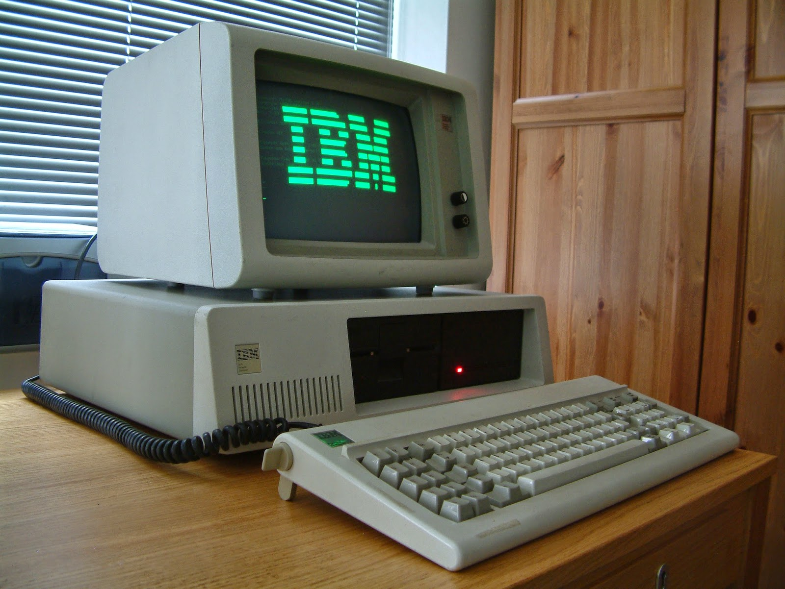
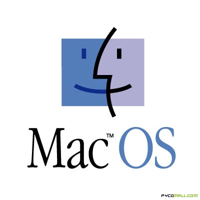
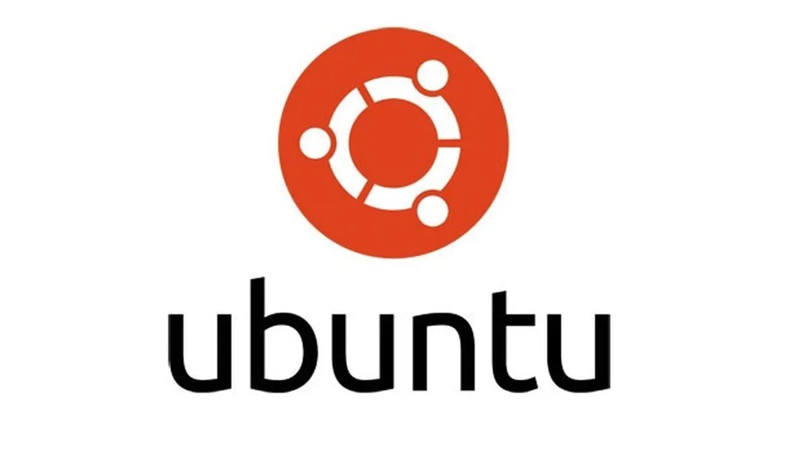
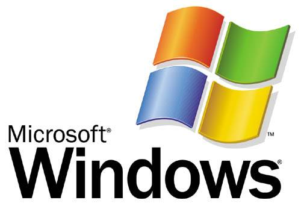

# Proyecto Final: Sistemas Operativos
## Integrantes:
## Luis Angel Hernandez Corrales(13480) y Alejandro Carrasco Maldonado()
### 6 de Diciembre del 2023

## Indice

 - Sistema operativo
 - Manipulación de archivos y directorios
 - Open Source
 - Historia de los sistemas operativos
 - Comandos básicos de la terminal Unix
 - Dispositivos de E/S
 - Procesos
 - Ejemplos de algoritmos de planeación
 - Almacenamiento
 - Jerarquía de memoria
 - Ejemplos de Virtualización del CPU, Virtualización de Memoria, Concurrencia, Persistencia
 - Personajes importantes para los sistemas operativos como Linus Torvalds y Denis Ritchie.
 - Instrucciones para instalar Linux o como instalar una nueva versión de Mac 

## Introduccion a los sistemas operativos
Un sistema operativo consiste en un conjunto de programas diseñados para facilitar la interacción y gestión de los componentes de una computadora o dispositivo electrónico durante su uso.

Los sistemas operativos existen para:

 - Computadoras
 - Telefonos
 - Televisiones
 - Relojes
 - Electrodomesticos

## Manipulacion de archivos y directorios

La manipulación de archivos y directorios es una parte fundamental en el funcionamiento de los sistemas operativos, permitiendo a los usuarios gestionar y organizar la información almacenada en sus dispositivos. En términos simples, implica llevar a cabo diversas acciones como la creación, eliminación, copia, movimiento o modificación de archivos y carpetas dentro de la estructura de almacenamiento de un sistema. Estas operaciones se realizan a través de comandos o interfaces gráficas proporcionadas por el sistema operativo, otorgando a los usuarios la capacidad de administrar eficazmente sus datos para satisfacer sus necesidades individuales o de trabajo.

 - Reconocer archivos o directorios, incluyendo su denominación, ubicación, permisos, entre otros detalles.
 - Generar un archivo recién creado.
 - Desplazar archivos de un lugar a otro.
 - Borrar directorios y archivos.

## Open Source

Se refiere al manejo de los múltiples ajustes o modificaciones aplicados a los componentes de un producto o su configuración.

## Historia de los sistemas operativos

### Primer Nivel

 - Sistemas operativos fundamentales.
 - Aparecieron en la década de 1950.
 - Utilización del lenguaje de programación FORTRAN.
 - La programación se realizaba mediante tarjetas perforadas.

### Segundo Nivel

- Surge en la década de 1960.
- Mejora la eficiencia en la utilización del procesador.
- Se introducen los procesos en línea (conexión directa a la computadora) y fuera de línea (conexión mediante dispositivos más veloces).
- Se desarrollan las técnicas de buffering y spooling. El buffering implica almacenar datos en memoria intermedia o buffer, mientras que el spooling implica almacenar datos en discos magnéticos.

### Tercer Nivel

 - Surge en la década de 1970.
 - Se introduce la multiprogramación: ejecución simultánea de múltiples programas en un solo procesador.

### Cuarto Nivel

 - Surge en la década de 1980.
 - Se incrementa la seguridad mediante la interconexión simultánea de múltiples computadoras que comparten memoria, buses y terminales.
 - La velocidad de procesamiento se eleva mediante la adopción de la tecnología de multiprocesamiento: sistemas informáticos que incorporan más de un procesador.

### Quinto Nivel

 - Sistemas operativos diseñados específicamente para dispositivos móviles.

### Historia de MacOS

Mac OS, inicialmente conocido como Macintosh System Software, surgió en los años 80 para la línea de computadoras Macintosh de Apple. Evolucionó a lo largo del tiempo, pasando por versiones como System 1, System 6, System 7 y Mac OS 9. En 2001, Apple presentó Mac OS X, basado en Unix y reconocido por su estabilidad y diseño innovador. Con el tiempo, el sistema se actualizó y en 2012 se renombró como "OS X", luego "macOS" en 2016, manteniendo su enfoque en simplicidad, seguridad y experiencia de usuario.

### Historia de Ubuntu

Ubuntu, una distribución de Linux desarrollada por Canonical Ltd. en 2004, se basa en Debian y se centra en ofrecer un sistema operativo estable y fácil de usar para usuarios principiantes y avanzados. Su nombre, que significa "humanidad hacia los demás" en un concepto sudafricano, refleja su filosofía de accesibilidad y enfoque en el software libre y de código abierto. A través de lanzamientos periódicos con nuevas características y mejoras, Ubuntu se ha convertido en una de las distribuciones de Linux más populares y reconocidas, especialmente valorada por su comunidad activa y su soporte a largo plazo en versiones LTS.

### Windows

Windows, desarrollado por Microsoft, se lanzó en 1985 como una interfaz gráfica para sistemas operativos MS-DOS. Las versiones posteriores como Windows 3.0, Windows 95, y Windows XP introdujeron mejoras significativas en la interfaz y funcionalidad. A lo largo de los años, Windows continuó evolucionando con versiones como Windows Vista, Windows 7, Windows 8 y finalmente Windows 10, que adoptó un modelo de servicio con actualizaciones continuas. Windows 10 se ha mantenido como el sistema operativo principal para computadoras personales y portátiles, destacando por su enfoque en la seguridad, compatibilidad de aplicaciones y experiencia de usuario.

## Comandos basicos de la terminal Unix

- **cd**: Sirve para cambiar de directorio según se le indice
- **cd newFolder**: Sirve para crear un nuevo directorio en la ruta actual
- **history**: muestra el historial de comandos escritos en terminal
- **rm fileName**: Elimina un archivo con el nombre indicado
- **vim fileName**: Abre un archivo con el editor vim
- **ls**: muestra los archivos que se encuentran en esa ruta
- **touch fileName**: Crea un archivo con el nombre que se le indica
- **pwd “Print Working Directory”**: Se utiliza para imprimir el nombre del directorio actual en una sesión.
- **ls -la**: Agrega informacion extra e incluye los archivos ocultos
- **make directoyName**: Sirve para crear un directorio con el nombre que se le especifica
- **git init**: inicializa un repositorio de git
- **git add .**: agrega todos los cambios nuevos que estan en nuestra maquina local
- **git commit -m “mensaje”**: guarda un cambio de nuestro repositorio para subirlo a la nube
- **git push**: sube los cambios a nuestro cliente remoto por ejemplo github

## Dispositivos de E/S

### Dispositivos de Entrada:

Los dispositivos de entrada son herramientas que se encargan de ingresar datos a la memoria principal de la computadora para su procesamiento. Estos dispositivos convierten la información de entrada en señales eléctricas.

### Dispositivos de Salida:

Los dispositivos de salida son los elementos que muestran la información al usuario en formatos comprensibles, ya sea mediante imágenes, texto, sonidos o mediante interfaces táctiles. Su función principal consiste en sacar datos desde la memoria principal hacia el entorno externo.

### Dispositivos Mixtos:

Los dispositivos de entrada y salida, también conocidos como dispositivos mixtos, posibilitan tanto la entrada como la salida de datos hacia y desde la memoria central.

