# Proyecto Final: Sistemas Operativos
## Integrantes:
## Luis Angel Hernandez Corrales(13480) y Alejandro Carrasco Maldonado(13817)
## 6 de Diciembre del 2023

## Indice

 - Sistema operativo
 - Manipulación de archivos y directorios
 - Open Source
 - Historia de los sistemas operativos
 - Comandos básicos de la terminal Unix
 - Dispositivos de E/S
 - Procesos
 - Planificacion de procesos
 - Almacenamiento
 - Jerarquía de memoria
 - Ejemplos de Virtualizacion de CPU, Memoria, Concurrencia y Persistencia
 - Personajes importantes para los sistemas operativos
 - Pasos para instalar Linux

## Introduccion a los sistemas operativos
Un sistema operativo consiste en un conjunto de programas diseñados para facilitar la interacción y gestión de los componentes de una computadora o dispositivo electrónico durante su uso.

Los sistemas operativos existen para:

 - Computadoras
 - Telefonos
 - Televisiones
 - Relojes
 - Electrodomesticos

## Manipulacion de archivos y directorios

La manipulación de archivos y directorios es una parte fundamental en el funcionamiento de los sistemas operativos, permitiendo a los usuarios gestionar y organizar la información almacenada en sus dispositivos. En términos simples, implica llevar a cabo diversas acciones como la creación, eliminación, copia, movimiento o modificación de archivos y carpetas dentro de la estructura de almacenamiento de un sistema. Estas operaciones se realizan a través de comandos o interfaces gráficas proporcionadas por el sistema operativo, otorgando a los usuarios la capacidad de administrar eficazmente sus datos para satisfacer sus necesidades individuales o de trabajo.

 - Reconocer archivos o directorios, incluyendo su denominación, ubicación, permisos, entre otros detalles.
 - Generar un archivo recién creado.
 - Desplazar archivos de un lugar a otro.
 - Borrar directorios y archivos.

## Open Source

Se refiere al manejo de los múltiples ajustes o modificaciones aplicados a los componentes de un producto o su configuración.

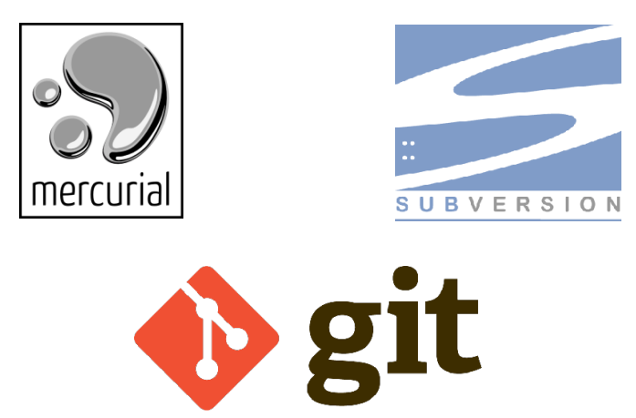

## Historia de los sistemas operativos

### Primer Nivel

 - Sistemas operativos fundamentales.
 - Aparecieron en la década de 1950.
 - Utilización del lenguaje de programación FORTRAN.
 - La programación se realizaba mediante tarjetas perforadas.

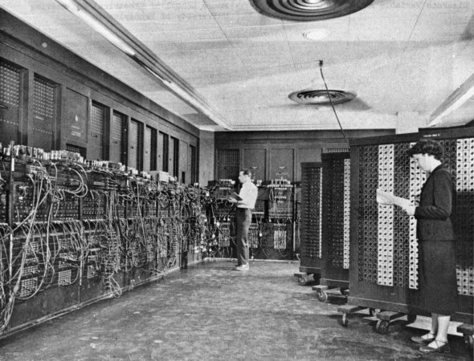

### Segundo Nivel

- Surge en la década de 1960.
- Mejora la eficiencia en la utilización del procesador.
- Se introducen los procesos en línea (conexión directa a la computadora) y fuera de línea (conexión mediante dispositivos más veloces).
- Se desarrollan las técnicas de buffering y spooling. El buffering implica almacenar datos en memoria intermedia o buffer, mientras que el spooling implica almacenar datos en discos magnéticos.

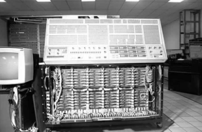

### Tercer Nivel

 - Surge en la década de 1970.
 - Se introduce la multiprogramación: ejecución simultánea de múltiples programas en un solo procesador.

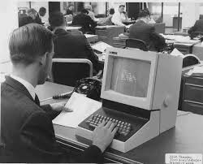

### Cuarto Nivel

 - Surge en la década de 1980.
 - Se incrementa la seguridad mediante la interconexión simultánea de múltiples computadoras que comparten memoria, buses y terminales.
 - La velocidad de procesamiento se eleva mediante la adopción de la tecnología de multiprocesamiento: sistemas informáticos que incorporan más de un procesador.

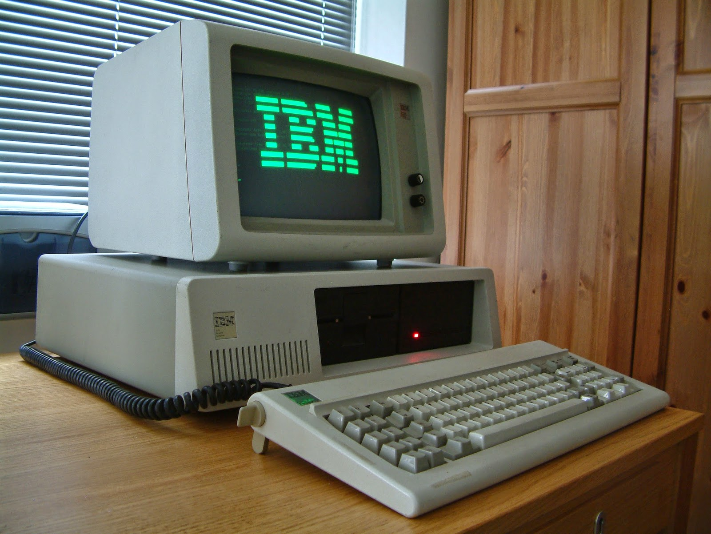

### Quinto Nivel

 - Sistemas operativos diseñados específicamente para dispositivos móviles.

### Historia de MacOS

Mac OS, inicialmente conocido como Macintosh System Software, surgió en los años 80 para la línea de computadoras Macintosh de Apple. Evolucionó a lo largo del tiempo, pasando por versiones como System 1, System 6, System 7 y Mac OS 9. En 2001, Apple presentó Mac OS X, basado en Unix y reconocido por su estabilidad y diseño innovador. Con el tiempo, el sistema se actualizó y en 2012 se renombró como "OS X", luego "macOS" en 2016, manteniendo su enfoque en simplicidad, seguridad y experiencia de usuario.

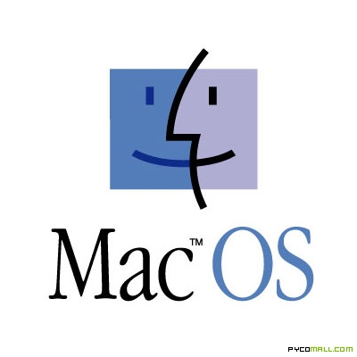

### Historia de Ubuntu

Ubuntu, una distribución de Linux desarrollada por Canonical Ltd. en 2004, se basa en Debian y se centra en ofrecer un sistema operativo estable y fácil de usar para usuarios principiantes y avanzados. Su nombre, que significa "humanidad hacia los demás" en un concepto sudafricano, refleja su filosofía de accesibilidad y enfoque en el software libre y de código abierto. A través de lanzamientos periódicos con nuevas características y mejoras, Ubuntu se ha convertido en una de las distribuciones de Linux más populares y reconocidas, especialmente valorada por su comunidad activa y su soporte a largo plazo en versiones LTS.

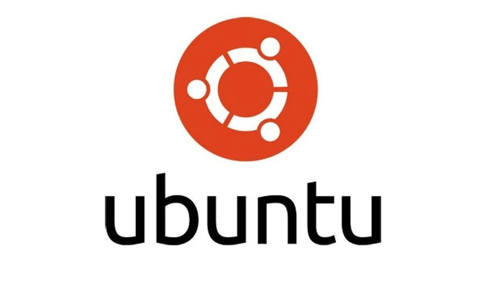

### Windows

Windows, desarrollado por Microsoft, se lanzó en 1985 como una interfaz gráfica para sistemas operativos MS-DOS. Las versiones posteriores como Windows 3.0, Windows 95, y Windows XP introdujeron mejoras significativas en la interfaz y funcionalidad. A lo largo de los años, Windows continuó evolucionando con versiones como Windows Vista, Windows 7, Windows 8 y finalmente Windows 10, que adoptó un modelo de servicio con actualizaciones continuas. Windows 10 se ha mantenido como el sistema operativo principal para computadoras personales y portátiles, destacando por su enfoque en la seguridad, compatibilidad de aplicaciones y experiencia de usuario.

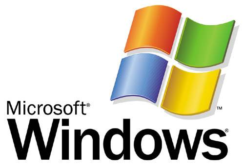

## Comandos basicos de la terminal Unix

- **cd**: Sirve para cambiar de directorio según se le indice
- **cd newFolder**: Sirve para crear un nuevo directorio en la ruta actual
- **history**: muestra el historial de comandos escritos en terminal
- **rm fileName**: Elimina un archivo con el nombre indicado
- **vim fileName**: Abre un archivo con el editor vim
- **ls**: muestra los archivos que se encuentran en esa ruta
- **touch fileName**: Crea un archivo con el nombre que se le indica
- **pwd “Print Working Directory”**: Se utiliza para imprimir el nombre del directorio actual en una sesión.
- **ls -la**: Agrega informacion extra e incluye los archivos ocultos
- **make directoyName**: Sirve para crear un directorio con el nombre que se le especifica
- **git init**: inicializa un repositorio de git
- **git add .**: agrega todos los cambios nuevos que estan en nuestra maquina local
- **git commit -m “mensaje”**: guarda un cambio de nuestro repositorio para subirlo a la nube
- **git push**: sube los cambios a nuestro cliente remoto por ejemplo github

## Dispositivos de E/S

### Dispositivos de Entrada:

Los dispositivos de entrada son herramientas que se encargan de ingresar datos a la memoria principal de la computadora para su procesamiento. Estos dispositivos convierten la información de entrada en señales eléctricas.

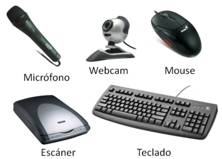

### Dispositivos de Salida:

Los dispositivos de salida son los elementos que muestran la información al usuario en formatos comprensibles, ya sea mediante imágenes, texto, sonidos o mediante interfaces táctiles. Su función principal consiste en sacar datos desde la memoria principal hacia el entorno externo.

### Dispositivos Mixtos:

Los dispositivos de entrada y salida, también conocidos como dispositivos mixtos, posibilitan tanto la entrada como la salida de datos hacia y desde la memoria central.

# Procesos

Consiste en la realización de una serie de tareas e instrucciones que conllevan a un resultado final.

Todo proceso cuenta con las siguientes caracteristicas:

- Identificador: Sirve para distinguir a un proceso de los otros

- Estado: Muestra si el proceso esta siendo creado, si esta en ejecución, si esta esperando a que sea asignado a un procesador o si ha finalizado

- Prioridad: Indica el nivel de importancia que tiene un proceso en comparación al resto

- Contador de programa: La dirección de la siguiente instrucción del programa que se ejecutará

- Punteros a memoria: Incluye los punteros al código de programa y los datos asociados a dicho proceso

- Datos de contexto: Estos son datos que están presentes en los registros del procesador cuando el proceso está corriendo

- Información de estado de E/S: Es todo lo relacionado a dispositivos de entrada y salida

- Información de auditoria: Puede incluir la cantidad de tiempo de procesador y de tiempo de reloj utilizados, así como los límites de tiempo, registros contables, etc.

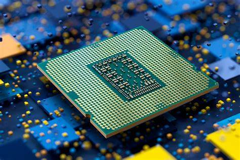

### Hilo

Un hilo (tambien conocido como thread) es un subproceso de un proceso que consume recursos propios pero que depende del proceso padre que lo ha ejecutado.

Estos mejoran el rendimiento de los sistemas operativos a partir de un uso optimizado de memoria.

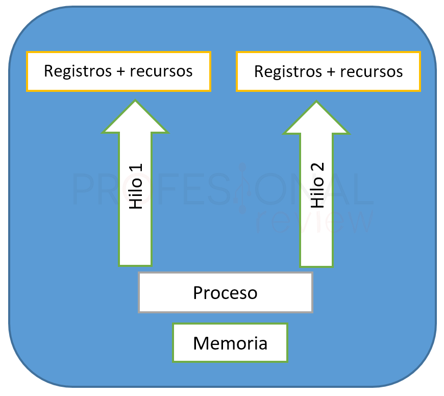

### Transición de los procesos

Un proceso puede encontrarse en una de las siguientes transiciones:

- Transición A: Ocurre cuando el programa que está en ejecución necesita algún elemento para continuar ejecutándose.

- Transición B: Ocurre cuando un programa o proceso ha utilizado el tiempo asignado por el procesador para su ejecución y tiene que dar paso al siguiente proceso.

- Transición C: Ocurre cuando el proceso que está preparado pasa al proceso de ejecución.

- Transición D: Ocurre cuando el proceso pasa de estar bloqueado a estar preparado, es decir, cuando el proceso recibe una orden o señal que estaba esperando para pasar al estado de preparado y, posteriormente, tras la transición, a estado de ejecución.

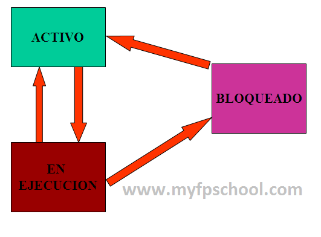

### Interrupciones

Una interrupción es una suspensión temporal de la ejecución de un proceso, para pasar a ejecutar una subrutina de servicio de interrupción, la cual, por lo general, no forma parte del programa, sino que pertenece al sistema operativo o al BIOS.

Una vez finalizada dicha subrutina, se reanuda la ejecución del programa.

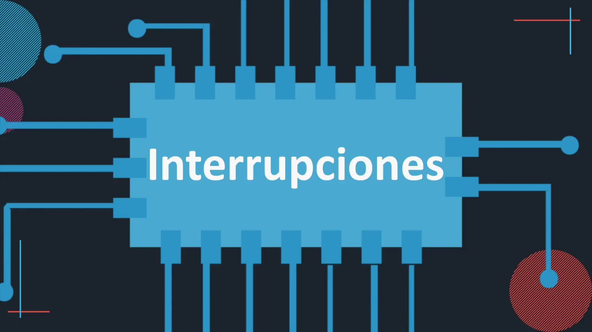

## Planificación de procesos

Los siguientes son diferentes algoritmos de planificación de procesos:

- FCFS: Es un algoritmo que utiliza una fila de procesos determinando el funcionamiento de cada proceso por el orden de llegada.

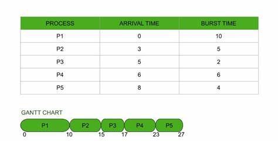

- SJF: Es un algoritmo que programa los trabajos por orden de duración, siendo el más corto el que se programa primero.

- Round Robin: Es un algoritmo donde se determina el mismo tiempo para la ejecución de todos los procesos. Si un proceso no puede ejecutarse por completo en el tiempo asignado su ejecución será después de la ejecución de todos los procesos que se ejecuten con el tiempo asignado.

- Planificación por prioridad: A cada proceso se le asigna una prioridad y se continúan con un criterio determinado. Los procesos serán atendidos de acuerdo con la prioridad determinada.

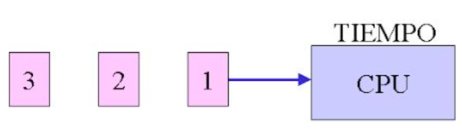

- Planificación garantizada: En esta planificación el sistema se enfoca en la cantidad de usuarios que debe atender. 

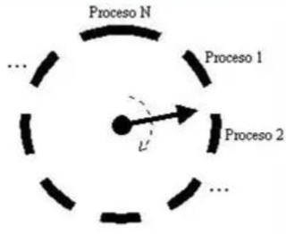

- Planificación de colas múltiples: Es un algoritmo donde la cola de procesos en estado de listos se divide en varias colas más pequeñas.

### Multiprocesamiento

Un sistema operativo multiproceso se refiere al número de procesadores del sistema, que es más de uno y éste es capaz de usarlos todos para distribuir su carga de trabajo.

### Colas de planificación de procesos

Cada uno de los procesos que entran al sistema, son puestos en un Job Queue o cola de trabajo que consiste en todos los procesos dentro del sistema.

Los procesos que residen en la memoria principal, estan listos y estan esperando a ser ejecutados se llama Ready Queue.

## Almacenamiento

- Bit (b): Simplemente es un 0 o 1, hay corriente o no hay corriente.

- Byte (B): Es la primera unidad de almacenamiento que tiene sentido, esta compuesta por 8 bits, un Byte es aproximadamente un caracter.

- Kilobyte (KB): 1024 Bytes

- Megabyte (MB): 1024 KB

- Gigabyte (GB): 1024 MB

- Terabyte (TB): 1024 GB

## Jerarquía de memoria

La jerarquía de memoria es la organización piramidal de la memoria en niveles que tienen las computadoras. El objetivo es conseguir el rendimiento de una memoria de gran velocidad al coste de una memoria de baja velocidad, basándose en el principio de cercanía de referencias.

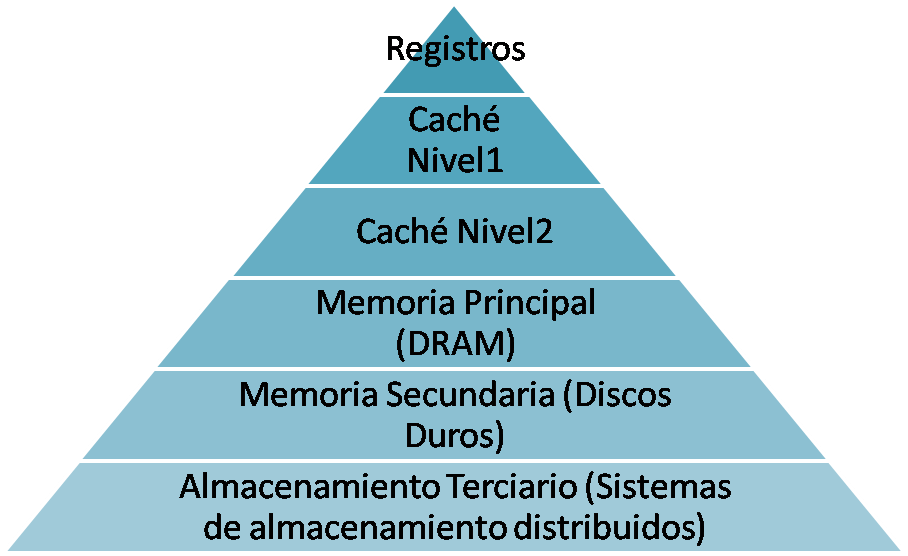
## Ejemplos de Virtualizacion de CPU, Memoria, Concurrencia y Persistencia

### Virtualización del CPU

Si se tienen dos maquinas virtuales con un sistema operativo en cada uno, entonces cada sistema operativo pensara que tienen su propio procesador, pero en realidad comparten un procesador físico.

### Virtualización de memoria

Si se tiene una aplicación A y una aplicación B que se ejecutan en un mismo sistema. Cada aplicación cree que tiene acceso exclusivo a la memoria del sistema, pero en realidad, el sistema operativo se encarga de asignar y gestionar el espacio de memoria compartido.

### Concurrencia

Si se tiene dos procesos (P1 y P2) que se ejecutan simultáneamente en un sistema entonces los hilos (T1 y T2) permiten que estas tareas se ejecuten concurrentemente.

### Persistencia

Si se tiene una aplicación que gestiona una lista de tareas, se utiliza una base de datos para persistir los datos, de modo que las tareas no se pierdan incluso después de cerrar la aplicación.

## Personajes importantes para los sistemas operativos

### Linus Torvalds

Linus Torvalds es un ingeniero de software finlandés y el creador del sistema operativo Linux. Torvalds inició el desarrollo de Linux en 1991 mientras era estudiante de informática en la Universidad de Helsinki.

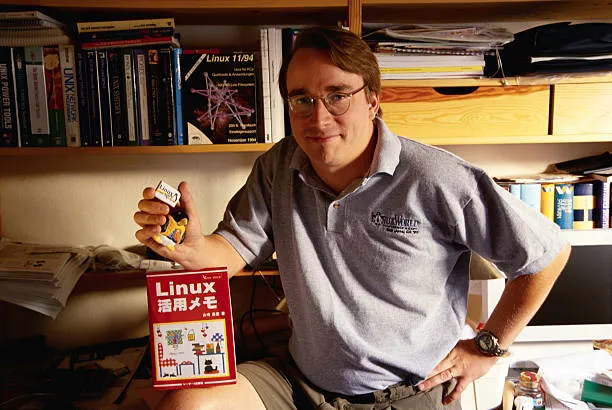

### Dennis Ritchie

Dennis Ritchie fue uno de los creadores del lenguaje de programación C y co-desarrollador del sistema operativo Unix.

## Pasos para instalar Linux

1) Elegir una distribución de Linux

2) Descargar la imagen ISO

3) Crear una USB de arranque

4) Arrancar desde el dispositivo de arranque

5) Iniciar el proceso de instalación

6) Configurar la instalación

7) Particionar el disco (opcional)

8) Finalizar instalación

9) Reiniciar

10) Abrir sistema operativo instalado

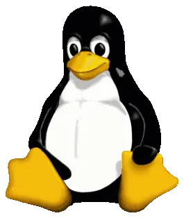

# Gracias